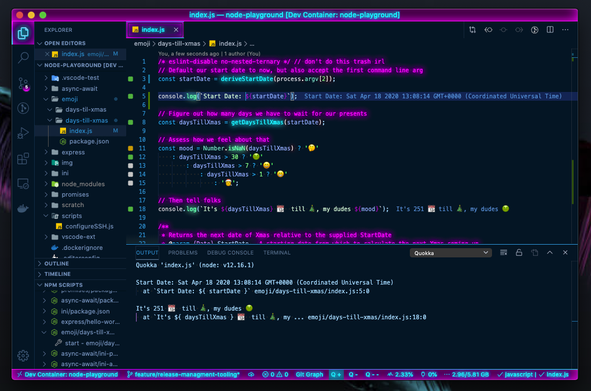
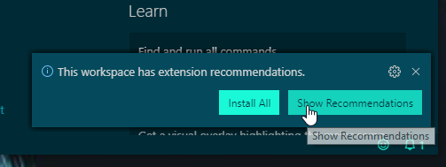
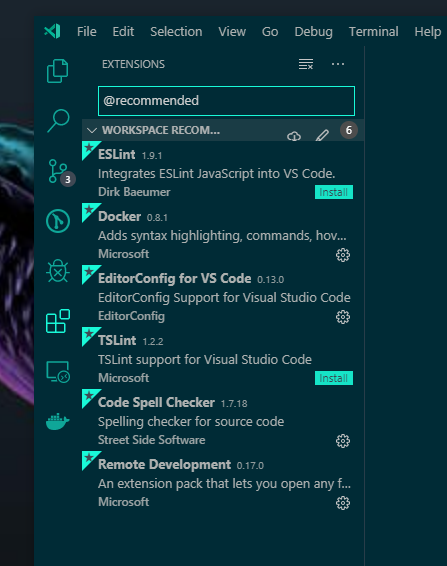
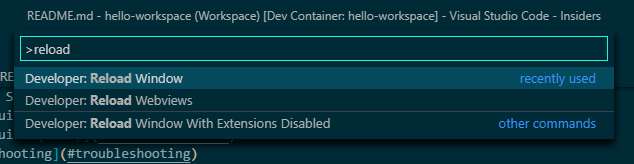
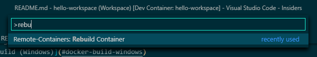
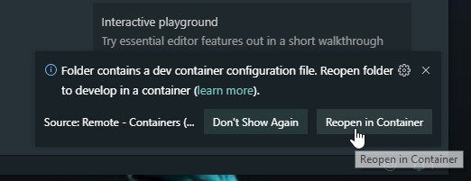
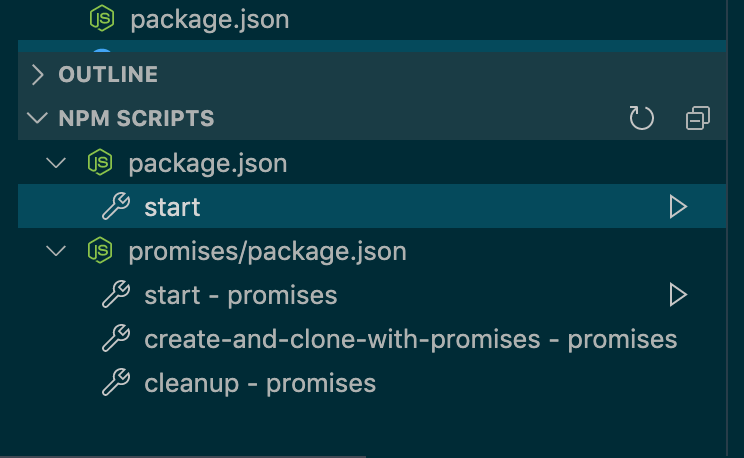

# deno-playground

[](https://hub.docker.com/r/calebhankins/deno-playground/)
[](https://hub.docker.com/r/calebhankins/deno-playground/)


*A Containerized playground for experimenting with Node.js using [vscode's Remote - Containers](https://code.visualstudio.com/docs/remote/containers) feature.*

- [deno-playground](#deno-playground)
- [Mission Statement](#mission-statement)
- [Workspace Features](#workspace-features)
  - [Live Javascript Scratchpad](#live-javascript-scratchpad)
  - [Release Management Tooling](#release-management-tooling)
- [Using This Guide](#using-this-guide)
- [Pre-Req Checklist](#pre-req-checklist)
  - [Docker](#docker)
  - [.ssh Folder](#ssh-folder)
  - [vscode](#vscode)
    - [vscode extensions](#vscode-extensions)
- [General Troubleshooting](#general-troubleshooting)
  - [Reloading the Window / Rebuilding the Container](#reloading-the-window--rebuilding-the-container)
  - [Resetting vscode AppData](#resetting-vscode-appdata)
- [Reopen in a Dev Container and Start Hacking](#reopen-in-a-dev-container-and-start-hacking)
  - [Hello, World!](#hello-world)
- [Container Persistence Through Rebuilds](#container-persistence-through-rebuilds)
- [Related Links & Credits](#related-links--credits)

# Mission Statement

This guide aims to provide a starting Node playground to experiment with Node.js programs in a standardized environment (described by Dockerfile(s)). This guide is written for developers using [vscode's remote container development](https://code.visualstudio.com/docs/remote/containers).


If you're brand new to vscode, you can check out their [series of intro vids to get started](https://code.visualstudio.com/docs/getstarted/introvideos#VSCode).


# Workspace Features

## Live Javascript Scratchpad
[Quokka](https://quokkajs.com/) is a slick prototyping tool for javascript development. The Quokka configuration settings are persisted into a docker volume to persist changes through rebuilds.

These included extensions add integrated support for Quokka in vscode.
* [Quokka.js](https://marketplace.visualstudio.com/items?itemName=WallabyJs.quokka-vscode)
* [Quokka Statusbar Buttons](https://marketplace.visualstudio.com/items?itemName=sketchbuch.vsc-quokka-statusbar)

You can give it a try by opening the [Days 'Till Xmas](./emoji/days-till-xmas/index.js) sample app and hitting one of the `Q` buttons in the status bar.




## Release Management Tooling

The workspace includes a release management tool for our components: [Release It! 🚀](https://github.com/release-it/release-it#release-it-). If not using this tool, make sure to update the version manually in the target project's package.json, package-lock.json (if the project has these files), and the [git tag](https://github.com/release-it/release-it/blob/master/docs/git.md).

```bash
# Example minor release of this workspace project
release-it minor
```


# Using This Guide
All commands referenced in this document will refer to '.' as the same folder in which this README can be found.

All commands are assumed to be ran under `powershell` for Windows hosts and `bash` for *nix hosts.

<!-- !Add this section back if the init script or $HOME code is added back to the devcontainer.json
# Initial Setup

This repository is my local dev env and is meant to serve as an example or demo. It will need some finesse to meet your local host's needs. The [devcontainer.json](.devcontainer/devcontainer.json) will need to be tweaked to suite your environment before you start.

**In my [devcontainer.json](.devcontainer/devcontainer.json) I am interacting with my `$HOME` directory's files via [docker's mount](https://docs.docker.com/storage/bind-mounts/) which you might not be in to. Please review the code this file intends to execute before running via [vscode remote containers](https://code.visualstudio.com/docs/remote/containers). and make sure you're good with that.** This workspace will still function without mounting your `$HOME`, but you will need to tweak the devcontainer and comment out anything that references mounting `${env:HOME}`, `${env:USERPROFILE}` or `~` first so the `docker run` command that vscode generates will not fail. -->

# Pre-Req Checklist
## Docker
- [Docker Desktop running locally](https://www.docker.com/products/docker-desktop)
- You must have local volume mounts working to get the most out of this guide. You can test you local drive mounting with the following code:

```powershell
# This should print the contents of your host OS home folder. 
docker run --rm -v ~:/data alpine ls /data
```

## .ssh Folder
This workspace is setup to be a starting development workspace. To hit the ground running with version control integration, the [devcontainer.json](.devcontainer/devcontainer.json) is set to mount files from your host `~/.ssh` folder. If you don't have one of these, you can create the following files on your host, or comment out the `.ssh/*` entries in the `mounts` section of the [devcontainer.json](.devcontainer/devcontainer.json) file.

```bash
# Expected ssh files on host
~/.ssh/id_rsa
~/.ssh/id_rsa.pub
~/.ssh/known_hosts
~/.ssh/authorized_keys
```

## vscode
- [vscode](https://code.visualstudio.com/download) or [vscode insiders](https://code.visualstudio.com/insiders/) if you're a cool kid.
  - You will need v1.38+ to use the `Remote - Containers` feature.
  - As of 2019-09-18, I'd recommend using [Insiders](https://code.visualstudio.com/insiders/) as these features are still in Preview and Insiders gets bug fixes sooner.


### vscode extensions
*Note, if you open the root folder of this project in vscode, you should get a prompt to install the recommended extensions.*

- 
- 

- Required
  - [Remote - Containers](https://marketplace.visualstudio.com/items?itemName=ms-vscode-remote.remote-containers)
- Recommended
  - For the full list of recommended extensions, checkout the [extensions.json](.vscode/extensions.json) file included in this repository.


# General Troubleshooting
## Reloading the Window / Rebuilding the Container
As of the writing of this doc, vscode remote-containers is still really new. Some of the sharp edges are still there and may require some extra finesse. As a general rule of thumb, if something isn't loading in the remote environment, try to [reload window](./img/reload_window.png) or [rebuilding the container](./img/rebuild_container.png).

- 
- 

## Resetting vscode AppData
If your workspace becomes corrupted, opens to a blank screen, or has other issues that can't be mitigated through the gui, your local vscode settings can be inspected / reset at the following locations on your machine:

```yaml
# Mainline
Windows: "~/AppData/Roaming/Code"
Linux: "$HOME/.config/Code/"
macOS: "$HOME/Library/Application Support/Code"

# Insiders
Windows: "~/AppData/Roaming/Code - Insiders"
Linux: "$HOME/.config/Code - Insiders/"
macOS: "$HOME/Library/Application Support/Code - Insiders"
```

# Reopen in a Dev Container and Start Hacking
Open this folder in vscode configured with the pre-recs above and you should be prompted to reopen in Container. From there the .devcontainer config will be used to create and start your dev environment.

- 

## Hello, World!
To try our your new env, you can start by running the supplied ["Hello, World!" app](index.js) via npm start!




# Container Persistence Through Rebuilds
- The sample [devcontainer.json](.devcontainer/devcontainer.json) stores select folders as persistent volumes to speed up container rebuilds and avoid losing certain data and config. To clear out these settings, you can run `docker volume rm` for each volume that you'd like to reset. Note, you must also remove any containers that are using the volumes that you'd like to delete.

```bash
# Sample persistence reset for select volumes
docker volume rm deno-playground-node_modules
docker volume rm deno-playground-extensions
docker volume rm deno-playground-extensions-insiders
docker volume rm deno-playground-quokka
docker volume rm deno-playground-ash_history
```

See vscode remote's [Avoiding extension reinstalls on container rebuild](https://code.visualstudio.com/docs/remote/containers-advanced#_avoiding-extension-reinstalls-on-container-rebuild) for more details.

# Related Links & Credits
- [node-playground](https://github.com/calebHankins/node-playground) - A Containerized playground for experimenting with Node.js using vscode's Remote - Containers feature.
- [jankins-workspace](https://github.com/calebHankins/jankins-workspace), a containerized workspace for Jenkinsfile Shared Pipeline development using vscode's remote-container feature.
